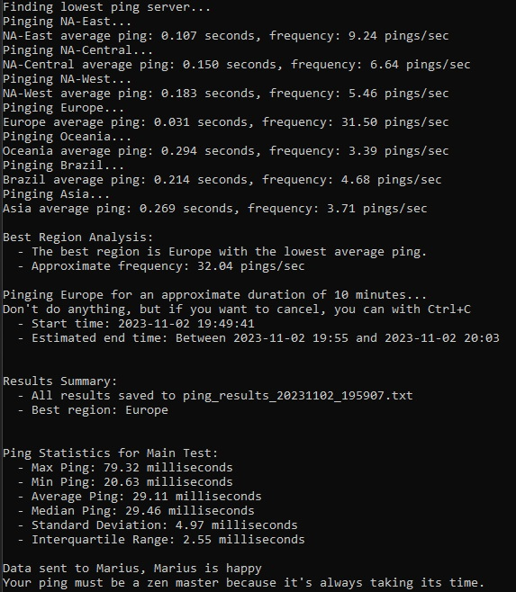

# Input Lag Simulator

## Introduction
Ever wondered if what you know about input lag is slightly off the mark? Well, it might be. I'm crafting a simulator that capitalizes on actual ping data collected from users over a span of roughly 10 minutes. This simulator aims to power a website where you can experiment with different controllers or mice to see if their input lag is significant enough to affect response times during gameplay. Picture this: two players firing at each other at the exact same moment—the one with the lower ping should win, right? However, the truth is a tad more nuanced. To shed light on this, I need your help to gather a robust set of data.

## Why only Fortnite servers?
Fortnite has dedicated ping servers one can ping. That is why it is only Fortnite servers. You dont need to be a Fortnite player to help.

## Data Collection
This tool is designed to measure your ping to the closest Fortnite server, continuously pinging it for 10 minutes. The data is then saved in a log file and sent to me. To prevent server overload, if the tool is used multiple times within an hour, it will refrain from sending the data.

The data shared will look like this:
- Region: NA-East
- Sent: 2023-11-02 17:55:14.823678, Received: 2023-11-02 17:55:14.976255
- Sent: 2023-11-02 17:55:14.976778, Received: 2023-11-02 17:55:15.101085

Please note that no personal information is stored in these files, just the timestamps for pings.

As a token of appreciation, every time you submit a log, you'll receive a random ping-related joke to lighten up your day!

## Running the Application

### Windows Executable:
For Windows users, an executable `.exe` version is provided for convenience. [Download the executable here](https://github.com/MariusHeier/ping_collector/raw/main/ping_collector.exe).

**Note:** Your antivirus might flag the `.exe` file initially because it’s an unrecognized application. This is a standard precautionary measure. Rest assured, the file is safe to use.

### Python Script:
Prefer not to run an executable file? Then you probably know how to run it with Python.

python ping_collector.py

[Download the Python version here](https://github.com/MariusHeier/ping_collector/raw/main/ping_collector.py)

If you got time to test all servers you can run this Python script here: [Download the test all version here](https://github.com/MariusHeier/ping_collector/raw/main/ping_collector_test_all.py)
ping_collector_test_all.py --all

## Longevity
This tool will remain operational even after my data collection phase ends, though it will be available for just a few days. I sincerely thank you for your contribution.

Stay tuned for the results, which I will be revealing in an upcoming video.

Marius